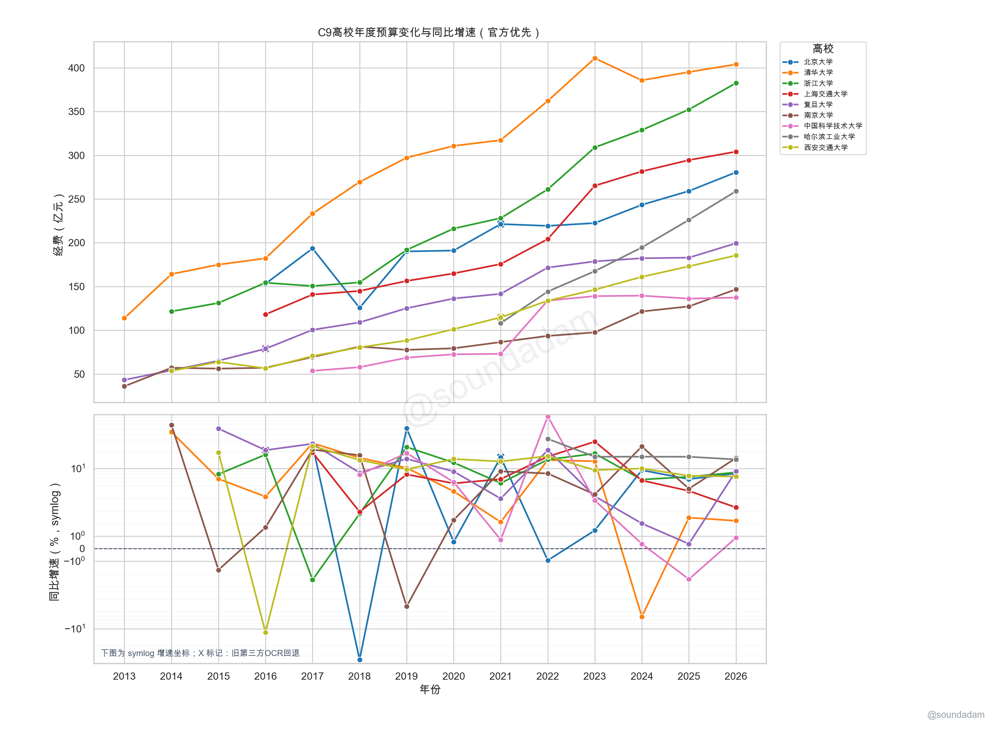

# China University Budget Dataset

`budget_uni` is an open dataset and extraction workflow for Chinese university budget and final-account disclosures. The current focus is collecting and verifying **2013-2026 budget, final-account, income, expenditure, and fiscal-appropriation disclosures for universities affiliated with China's Ministry of Education**.



## Current Status

- **Scope**: Ministry of Education affiliated universities, 2013-2026, with budget and final-account disclosures as the main target.
- **Source types**: official university disclosure pages, finance-office pages, PDF/HTML disclosures, and legacy third-party yearly summary charts.
- **Official-source progress**: official materials have been crawled and extracted for most C9 universities; broader MOE-affiliated university coverage is still in progress.
- **Third-party-source progress**: yearly summary images around 2016-2026 are preserved and extracted into reviewed processed tables.
- **Recommended entry point**: use `data/processed/` for analysis, then inspect `data/raw/official_sources.csv` and the GitHub Release assets for source verification.

## TODO

- Complete official budget and final-account source coverage for MOE-affiliated universities from 2013 to 2026.
- Normalize finance metrics such as `budget`, `final_account`, `income_total`, `current_year_income`, `expense_total`, and `fiscal_appropriation_income`.
- Expand official extraction beyond the current mostly-C9 coverage.
- Manually review third-party OCR outputs and clearly mark fallback rows that should not be treated as official values.
- Improve row-level provenance from processed CSV rows back to original PDF/HTML files, page numbers, table names, and metric names.
- Add coverage reports showing which university-years have official sources, third-party-only data, or missing data.

## Quick Use

The most useful reviewed files are:

```text
data/processed/ministry_university_budget.csv
data/processed/ministry_university_final_accounts.csv
data/processed/ministry_university_financial_table.csv
data/processed/c9_budget_official_preferred.csv
data/processed/c9_budget_growth_official_preferred.csv
data/processed/c9_budget_cagr_official_preferred.csv
```

`c9_budget_official_preferred.csv` prefers official PDF/HTML extracted values. It falls back to legacy third-party OCR only when no official value has been extracted for that university-year.

## Repository Layout

```text
budget_uni/
  data/
    raw/
      images/                  # legacy third-party yearly summary images
      official_sources.csv      # official source registry; main provenance index
      official/                 # local placeholder for official PDFs/pages
      third_party/              # third-party source notes
      external/                 # macro or comparison sources
    interim/                    # OCR/PDF/table candidates; regenerable, not tracked
    processed/                  # reviewed CSVs, schema, reports, and figures
  docs/
    prompts/                    # extraction prompts and task notes
  notebooks/                    # exploratory analysis
  scripts/                      # discovery, extraction, cleaning, plotting, packaging
```

## Release Assets

Large raw and cache files are not stored in Git history. They are distributed through GitHub Releases:

```text
https://github.com/soundadam/budget_uni/releases/tag/raw-2026-05-07
```

Current release assets:

```text
budget_uni-raw-official-pdfs-2026-05-07.zip
budget_uni-interim-cache-2026-05-07.zip
budget_uni-release-manifest-2026-05-07.csv
sha256sums-2026-05-07.txt
```

## Reproduce Tables And Figures

Regenerate the official-preferred C9 tables and figures:

```zsh
source /Users/adam/.venvs/dev/.venv/bin/activate
python scripts/build_c9_official_preferred.py
```

Check C9 official source and extraction coverage:

```zsh
source /Users/adam/.venvs/dev/.venv/bin/activate
python scripts/report_official_source_coverage.py
```

Rebuild local Release assets:

```zsh
source /Users/adam/.venvs/dev/.venv/bin/activate
python scripts/build_release_assets.py --date 2026-05-07
```

## For Developers And Data Auditors

### Data Tables

Main reviewed budget table:

```text
data/processed/ministry_university_budget.csv
```

Key fields:

| Field | Meaning |
| --- | --- |
| `year` | Budget year. |
| `university` | Normalized Chinese university name. |
| `budget_yi_yuan` | Amount normalized to 100 million CNY. |
| `source_url` | Source page or PDF URL. |
| `extraction_method` | OCR, vision model, manual check, or combined method. |
| `verified` | Whether the row has been manually checked. |
| `notes` | Scope, metric, source, or quality notes. |

Official-preferred C9 tables add:

| Field | Meaning |
| --- | --- |
| `source_type` | `official_pdf`, `official_html`, or `third_party_ocr_fallback`. |
| `metric_code` | Metric used for the value, such as `budget_total` or `income_total`. |
| `source_coverage_notes` | Source coverage notes in summary outputs. |

See the full schema:

```text
data/processed/schema.md
```

### Source Priority

1. Prefer official PDF/HTML disclosures.
2. Keep budget and final-account values separate.
3. Do not mix annual budget, income total, current-year income, expenditure, fiscal appropriation, and final-account values into one time series.
4. Use third-party OCR rows only as fallback data or discovery clues.
5. Preserve `source_url`, `source_type`, `metric_code`, and `notes` in derived datasets.

### Analysis Notes

The C9 growth chart uses a symmetric log (`symlog`) y-axis for year-over-year growth. This keeps negative growth visible while making both small and unusually large changes readable. The current linear region is `-5%` to `5%`, with minor y-axis ticks enabled.

CAGR is available in:

```text
data/processed/c9_budget_cagr_official_preferred.csv
```

CAGR is useful for long-run comparison, but it should not replace year-over-year analysis. Annual growth is better for identifying policy shocks, source changes, missing values, and one-year anomalies.

### Main Scripts

| Script | Purpose |
| --- | --- |
| `scripts/discover_download_official_pdfs.py` | Discover and download official budget/final-account PDFs. |
| `scripts/process_all_official_pdfs.py` | Batch extract text, tables, and fact candidates from official PDFs. |
| `scripts/official_html_extract.py` | Extract finance facts from official HTML disclosure pages. |
| `scripts/build_c9_official_preferred.py` | Build C9 official-preferred tables, growth, CAGR, and figures. |
| `scripts/report_official_source_coverage.py` | Report C9 official source and extraction coverage for 2013-2026. |
| `scripts/build_release_assets.py` | Build local Release bundles for official PDFs and interim cache. |

More script notes are in `scripts/README.md`.

## Citation

If you use this repository, cite it and preserve source fields in derived work:

```text
Adam. China University Budget Dataset (budget_uni). 2026.
```

Code is released under the MIT License. Data rows compiled by this project are intended for reuse with attribution; original source PDFs, pages, and third-party images remain subject to their original publishers' rights and terms.
